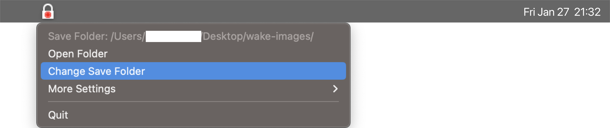
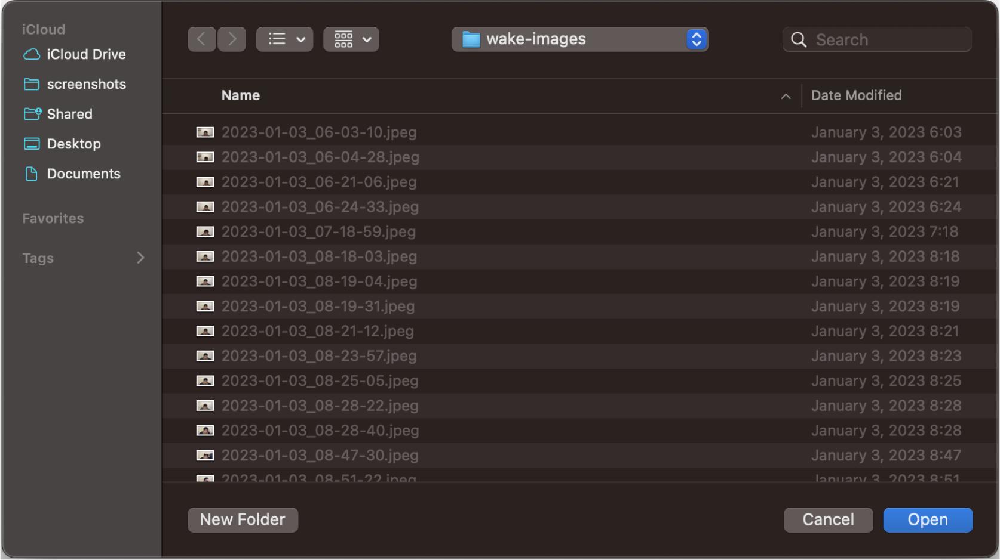
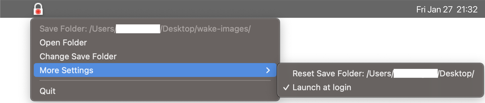

wake-camera-macos
====

[日本語 README.md](README_jp.md)

A macOS app that takes a picture when the device awake from sleep

 

## Background

I had been used a macOS app called [Snoop Catcher](https://macdaddy.io/snoop-catcher/) developed by MacDaddy.

The app had no longer maintained for years and not working correctly since last several version of macOS.

This is the reason why I decided to make this app.

 

## Features

### Overview

This app runs in background and menubar app.

When your device awake from sleep, start built-in webcam and take a picture.

Your face is changing day by day.

It is just fun to show through your face changing for years.

### Change the folder to save

You can change the folder where captured images are save.

Change the folder from menubar icon.

### Launch at login

You can add this app to login items.

Check the setting from "More Settings > Launch at login" on the menu.

 

Thats all.

Feel free to send me any feature request from issues.
## Contribution

Welcome. Please.

 

## License

[MIT](https://github.com/tcnksm/tool/blob/master/LICENCE)

 

## Author

[un4v5s](https://github.com/un4v5s)

