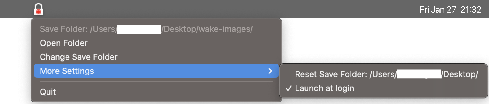

wake-camera-macos
====

[English README](README.md)

### 概要

これは、デバイスがスリープから復帰したときに写真を撮影する macOS アプリです。

このアプリはメニューバーアプリで、バックグラウンドで動作します。

私たちの顔は、日々少しずつ変化していきます。

年月を経て変化していく自分の顔を見るのは楽しいものです。

 

## 背景

私は、数年前までMacDaddyによって開発された[Snoop Catcher](https://macdaddy.io/snoop-catcher/)というアプリを利用していました。

しかし、数年前のmacOSのアップデートから、真っ黒い写真しか撮れなくなり、うまく動作していませんでした。

そのため、自分で作ることにしました。

 

## 特徴

- 画像の保存先フォルダの変更

メニューバーのアイコンをクリックし、キャプチャ画像の保存先フォルダを変更することができます。

- ### ログイン項目に追加

このアプリケーションをログイン項目に追加することができます。

メニューの「その他の設定 > ログイン時に起動」から設定をオンにすることができます。

 

## コントリビューション

ぜひお願いします。

機能要望があれば、issueで気軽に送ってください。

## ライセンス

[MIT](https://github.com/tcnksm/tool/blob/master/LICENCE)

## 開発者

[un4v5s](https://github.com/un4v5s)。

## 謝辞

- [LaunchAtLogin-Modern](https://github.com/sindresorhus/LaunchAtLogin-Modern)
- SwiftUIとCombineでカメラアプリを作る](https://www.kodeco.com/26244793-building-a-camera-app-with-swiftui-and-combine)